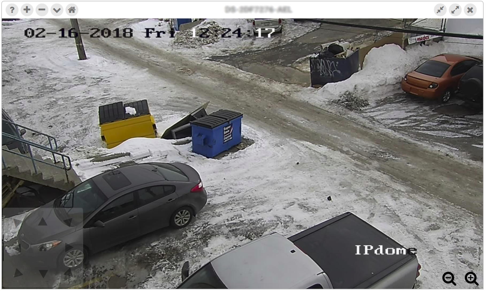

# ONVIF

This is a good project for anyone interested in programming ONVIF-compliant cameras. However, in an unconventional way, the server code was written into the `build/script.dev.js` because it was _quick and dirty_. The application uses sockets to communicate ONVIF commands with the client.

This sample application will not do much if you do not have any ONVIF-compliant cameras on your network. If you don't know if you have an ONVIF-compliant camera, you can verify it [here](https://www.onvif.org/conformant-products/). Occassionally, some cameras need a firmware upgrade to support ONVIF (depending on age), in which case, refer to your camera manufacturer's website and support information for your particular camera.

## Preview

## Features

1. Discovery
2. Device Information
3. Snapshot
4. Pan / Tilt / Zoom (PTZ)
5. GotoHomePosition / SetHomePosition
6. GotoPreset / SetPreset / RemovePreset

## Usage

To install, run `npm install`.
If you have an ONVIF-compliant camera, you can start the app with `npm run dev`. A web browser at port `8080` will automatically be started.
